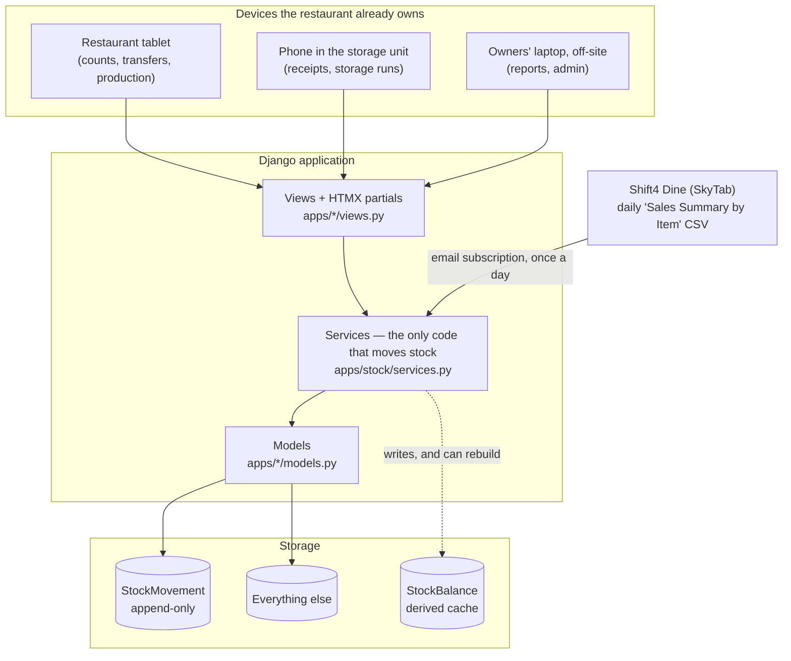

# Architecture

Woodlands Indian Cuisine — Operations & Inventory Management System.

This document is written by hand and reviewed by a person, because judgement does
not generate. The parts that **can** be derived are: see
[`data-model.md`](data-model.md) for every table and field and
[`traceability.md`](traceability.md) for requirements against code. Both are
regenerated by `python manage.py docs` and CI fails if they are stale.

The decisions behind what follows are recorded, one per file, in [`adr/`](adr/).
This document says how the pieces fit; the ADRs say why they were chosen and what
each choice cost.

---

## 1. The shape of the thing

One Django project, server-rendered, with HTMX for the parts of a page that
change. No separate front end, no build step, no API to keep in sync with a
client. See ADR 0004.



Note what is **not** on that diagram. There is no live connection into the till.
If this system is down, the restaurant's ability to take money is unaffected —
that was a deliberate constraint, not a limitation (ADR 0003).

---

## 2. The apps, and where a thing belongs

| App | Holds | Depends on |
|---|---|---|
| `core` | `User` + roles, `Location`, `Area`, `Supplier`, `TimeStamped` | nothing |
| `catalog` | `Unit`, `Item`, `ItemAlias`, `PurchaseUnit`, `ParLevel`, `Recipe`, `RecipeLine` | `core` |
| `stock` | **`StockMovement`**, `StockBalance`, `GoodsReceipt`, `Transfer`, `StockCount`, `WasteEvent`, `services.py` | `core`, `catalog` |
| `production` | `ProductionBatch`, `ProductionInput`, `BatchSplit` | `catalog`, `stock` |
| `sales` | `PosItem` mapping, `SalesImport`, `SalesImportLine` | `catalog`, `stock` |
| `labour` | `BreakPolicy`, `Shift`, `ShiftEdit` | `core` |

Dependencies point one way only, left to right in that table. `core` imports from
nothing; nothing imports from `production` or `sales`. When a new model does not
obviously belong to one of these, that is a signal to stop and think rather than
to put it in `core`.

The one deliberate exception is the home screen, which lives in
`apps/core/views.py` rather than in `stock`. Its whole job is to show what is
outstanding across every app — unfinished storage runs, POS lines still to map —
so it crosses the layering by definition. Keeping it in `core` puts that crossing
somewhere expected, instead of quietly turning `stock` into the app that imports
everything.

---

## 3. The three invariants

Everything else in the system is arrangeable. These three are not, and a change
that breaks one of them is a redesign, not a refactor.

### 3.1 Stock is a ledger, not a number

```
on_hand(item, location) = SUM(quantity) FROM stock_movement
```

Nothing — no receipt, no transfer, no count, no sale, no waste — edits a balance.
Everything appends a `StockMovement` through `apps.stock.services.post_movement`.
A mistake is corrected by writing its opposite (`reverse_movement`), never by
deleting or editing the original. `StockBalance` is a cache for speed and can be
rebuilt from the ledger at any time with `rebuild_balances()`.

There is a test (`test_cache_can_always_be_rebuilt_from_the_ledger`) that
deliberately corrupts the cache and rebuilds it, because that property is the
entire reason to accept the extra code. See ADR 0001.

*Implements FR-1203, FR-1204, NFR-18.*

### 3.2 Everything is an Item

A sack of urad dal, a bucket of dosa batter and a masala dosa are all `Item`
rows, differing only by `kind` — `RAW`, `PREPARED`, `DISH`. That is what lets one
recursive routine (`services.explode`) walk a sale all the way down to raw
materials: a dish explodes into bases, a base into raw materials, and recursion
stops at whatever has no active recipe. The alternative is three parallel
mechanisms that disagree with each other. See ADR 0002.

*Implements FR-602, FR-603, FR-610.*

### 3.3 Nothing is guessed

Where the system does not know something, it says so and stops. It does not
infer, approximate or fuzzy-match:

- An unmapped POS item blocks the whole import (`SalesImport.is_safe_to_post`).
  An unmapped item is a visible problem; a wrongly guessed one is an invisible
  wrong answer for months. The mapping screen groups names and suggests
  near-identical items, but a person confirms every one. See ADR 0005.
- A blank line on a count sheet means *not counted*, not zero.
- `traceability.md` marks a requirement covered only when a file actually names
  it. Nothing is inferred from a function looking roughly relevant.

---

## 4. How a request moves through the system

Storage run, as the clearest example:

1. `views.transfer_new` opens a `Transfer` in `DRAFT` at the source location.
2. `views.item_search` answers keystrokes over HTMX, searching item names **and
   aliases** — people search for what they call the thing, not what the supplier
   calls it (FR-202).
3. `views.transfer_add_line` appends a `TransferLine`. The same item twice adds
   up rather than making a second row.
4. `views.transfer_post` calls `services.post_transfer`, which writes **two**
   movements per line inside one transaction — out of source, in to destination.
   Stock cannot leave one place without arriving at the other.
5. The `Transfer` goes to `POSTED` and can never be posted again.

The pattern holds everywhere: **views handle the conversation with a human,
services handle the consequences.** A view never writes a `StockMovement`
directly, and a service never renders anything or reads `request`.

---

## 4a. Reading the till

The menu's 318 POS names are not 318 foods, and the mapping screen exists to
make that manageable rather than to guess at it:

- `apps/sales/naming.py` holds the reading rules — promotional prefixes, tub
  sizes — in one place, imported by the model, the services and the import
  command. Two copies of a regular expression agree only until somebody edits
  one of them.
- `PosItem.group_key` stores what a name reduces to, so the grouping a person
  saw when they decided is the grouping on record, and so the queue is one
  query rather than 318 regular expressions per page load.
- A tub size in a name is read **in ounces** and converted into whatever the
  target item is measured in. "Coconut Chutney 16 oz" against a chutney held
  in quarts is 0.5, not 16 — the conversion is the point, because carrying the
  number across would be a thirty-twofold error in a figure nobody re-checks.
- A dish is one dish whatever size the tub is. A bigger plate is a different
  dish, and its recipe says so. A food sold **by the ounce** is the other kind
  — a prepared component, the same pot the kitchen ladles from into dishes,
  not a separate thing that happens to share a name.
- Deciding 250 things in one sitting produces a predictable set of mistakes, so
  `services.review()` looks for them afterwards and `apps/catalog/services.py`
  offers the fixes: merge (keeping the old spelling as a searchable alias),
  convert to a component, retire. Both operations refuse outright once the item
  has stock movements against it — an item with a past cannot be redefined
  without rewriting what the ledger says happened.

*Implements FR-203, FR-610.*

## 5. Time

Two distinct times are recorded on every movement, and conflating them is how
reconciliation becomes impossible:

- `occurred_at` — when it physically happened. A storage run made at 3pm.
- `created_at` — when somebody typed it in. Possibly 6pm, possibly the next day.

Reports about the restaurant use `occurred_at`. Questions about who entered what
and when use `created_at`.

---

## 6. Units and money

Every quantity is stored in the item's **base unit**, as `Decimal`. Never float —
not for quantities, not for money. `QTY` is `(14, 4)` and `MONEY` is `(12, 4)`,
defined once in `apps/catalog/models.py` and imported everywhere else.

Conversion happens only at the edges, when somebody types "6 sacks" or "3 scoop".
`ItemMeasure` holds every named quantity that is not the base unit, in two kinds:

**How it is bought.** A pack carries an **optional supplier**, because urad dal
arrives in 25 lb sacks from one supplier and 20 lb sacks from another. A system
that assumes one number turns four sacks into twenty pounds of stock that does
not exist — one of the most common silent errors in food inventory, and very
hard to unpick a year later.

**How the kitchen measures it.** Every recipe here is written in scoops, spoons,
handfuls and bars. The kitchen weighed them on 16 September 2026:

| 1 scoop of… | weighs |
|---|---|
| Toor dal | 32 oz |
| Moong dal | 31 oz |
| Sambar powder | 14 oz |

A scoop is a **vessel, not a weight** — what it holds depends on what is in it,
and the same is true of the spoon (salt 2.2 oz, turmeric 1.4 oz, cumin 0.6 oz).
So the conversion belongs to the item and there is no global figure to store.
One number applied to everything would be wrong nearly everywhere it was used,
and wrong quietly: nobody re-checks a conversion.

This is why the table is `ItemMeasure` and not `PurchaseUnit`. It always held
"a named quantity of this item, worth this much in base units"; it was named
for the only use there was at the time. A name that is a lie in the schema is
the kind of lie that lasts.

*Implements FR-203, FR-204, FR-205.*

---

## 7. Work in progress is stock, but not yet usable

Batter is the case the whole production module exists for. A `ProductionBatch`
records what was *actually* used (`ProductionInput`), separately from the recipe,
because batter is judged by eye and assuming the formula produces confident wrong
numbers. A batch is `MATURING` until fermentation is judged complete, and
`expires_at` counts from `matured_at`, not from production. Ambient temperature is
recorded against the batch so that fermentation time can eventually be explained
rather than guessed at.

*Implements FR-503 through FR-509, FR-513.*

---

## 8. Roles and devices

The tablet is a **shared** device sitting in a restaurant. The laptop is a
**personal** device belonging to an owner. They are not given the same security:

- `User.can_use_pin` returns `False` for owners. An owner's account cannot be
  reached by a tablet PIN, however convenient that would be.
- `User.may_see_money` gates cost and wage figures, which is why a count sheet
  shows variance in units to a member of staff and in dollars to an owner.

*Implements FR-1202, NFR-11.*

---

## 9. What is deliberately absent

| Not built | Why |
|---|---|
| Payroll | The owners were explicit. A time module that quietly grows into a payroll engine acquires a compliance obligation nobody asked for. |
| A live POS integration | Behind a partner programme; a daily CSV answers the actual question. ADR 0003. |
| Fuzzy matching of POS names | See 3.3. |
| A JavaScript front end | Two maintainers, four weeks, and a shared tablet. ADR 0004. |
| Deployment configuration | Involves a hosting decision that carries cost, and that decision is the client's. Nothing has been committed on their behalf. |

---

## 10. Adding something without breaking the above

1. If it changes stock, it goes through `apps/stock/services.py`. No exceptions,
   including for a "quick fix", including for data migrations.
2. If it is a new table, `python manage.py makemigrations` **and**
   `python manage.py docs` in the same commit. CI fails otherwise, on purpose.
3. Reference the requirement it implements — write `FR-403` in the docstring or
   a comment — so it appears in `traceability.md` instead of being invisible.
4. Write the test that would have caught the bug you are afraid of, not the test
   that is easy to write.
